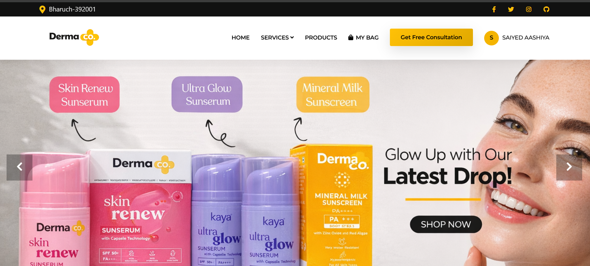
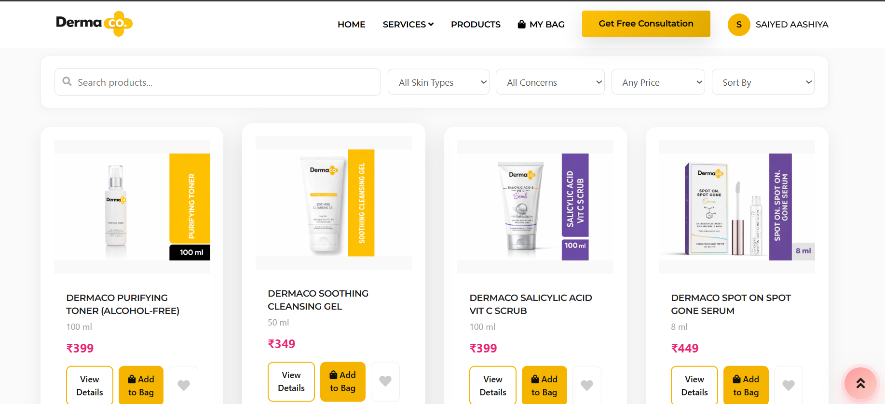
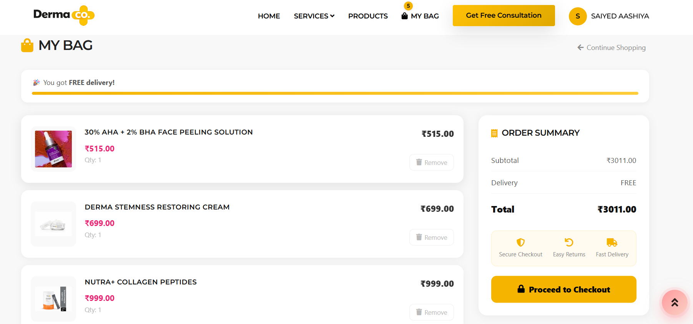
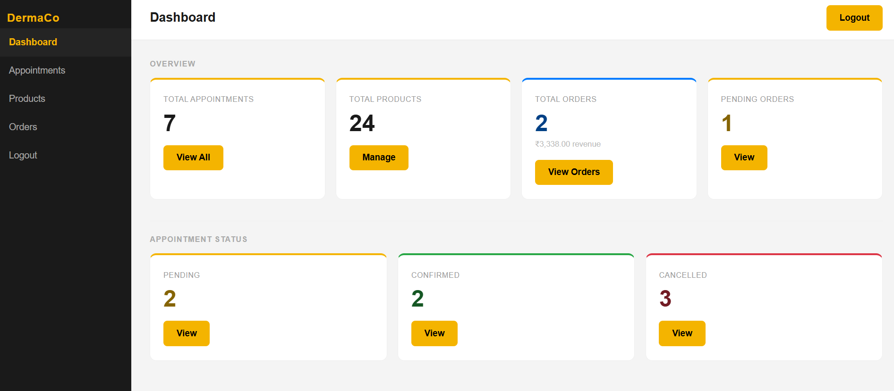

# DermaCo Web 🌿
### PHP Skincare E-commerce & Consultation Platform

A full-stack skincare platform built with PHP and MySQL, featuring an online product store, skin consultation booking system, and a complete admin panel — all within a single-page application (SPA) architecture.

---

## 🖥️ Live Preview

> Runs locally via XAMPP at `http://localhost/dermaco_web/`

---

## ✨ Features

### Customer Side
- **SPA Navigation** — smooth page transitions with no full reloads
- **Product Store** — browse, search, filter by skin type / concern / price, and sort products
- **Product Detail Page** — ingredients, best-for, concerns, and add-to-bag
- **Shopping Cart** — live item management, free delivery progress bar, quantity tracking
- **Wishlist** — save products and move them to cart in one click
- **Checkout** — delivery details form with inline order confirmation
- **Order History** — view all past orders with status tracking
- **Skin Consultation Booking** — date picker with real-time slot availability
- **Skin Quiz** — product recommendation engine based on skin type
- **User Profile** — view details and change password
- **Session-aware Navbar** — cart badge, user avatar, dropdown menu

### Admin Panel
- **Dashboard** — live counts for appointments, products, and orders
- **Appointments** — view, update status, delete, and send emails via PHPMailer
- **Products** — add, edit, toggle visible/hidden, upload images
- **Orders** — expand order items, update order status (pending → processing → shipped → delivered → cancelled)
- **Secure Login** — bcrypt password hashing, session-based auth

---

## 🛠️ Tech Stack

| Layer | Technology |
|---|---|
| Backend | PHP (procedural), MySQLi |
| Frontend | HTML, CSS, Bootstrap 4, Vanilla JS |
| Database | MySQL via XAMPP |
| Email | PHPMailer (SMTP / Gmail) |
| Alerts | SweetAlert2 |
| Local Server | XAMPP |

---

## 📁 Project Structure

```
dermaco_web/
├── index.php                  # SPA entry point
├── login.php / logout.php
├── products.json              # Product catalogue (source of truth)
├── admin/
│   ├── dashboard.php
│   ├── appointments.php
│   ├── products.php
│   ├── orders.php
│   └── login.php
├── api/                       # All fetch endpoints
│   ├── get-cart.php
│   ├── add-to-cart.php
│   ├── checkout.php
│   ├── get-orders.php
│   ├── save-appointment.php
│   ├── get-slots.php
│   └── ...
├── ASSETS/
│   ├── css/style.css
│   ├── js/
│   │   ├── edited.js          # SPA router + page loader
│   │   ├── app.js             # Cart, wishlist, orders, checkout
│   │   ├── products-data.js   # Loads + filters products.json
│   │   └── products-ui.js     # Search, filter, sort UI
│   └── images/products/
├── PAGES/                     # HTML page fragments
│   ├── home.html
│   ├── products.html
│   ├── cart.html
│   ├── checkout.html
│   ├── orders.html
│   ├── wishlist.html
│   ├── profile.html
│   └── Services/
├── CONTENT/
│   ├── header.php
│   └── footer.html
└── includes/db.php
```

---

## 🗄️ Database Schema

```sql
users         — id, name, email, password (bcrypt), role
admins        — id, username, password (bcrypt)
appointments  — id, name, email, phone, treatment, message,
                status, appointment_date, appointment_time, created_at
cart          — id, user_id, product_id, product_name,
                product_price, product_image, quantity, created_at
wishlist      — id, user_id, product_id, product_name,
                product_price, product_image, created_at
orders        — id, user_id, name, email, phone, address,
                city, payment_method, total, status, created_at
order_items   — id, order_id, product_id, product_name,
                product_price, product_image, quantity
```

---

## ⚙️ Local Setup

### Prerequisites
- XAMPP (PHP 7.4+, MySQL)
- Gmail account with an App Password (for PHPMailer)

### Steps

**1. Clone the repo**
```bash
git clone https://github.com/YOUR_USERNAME/dermaco_web.git
```

**2. Move to XAMPP**

Place the `dermaco_web/` folder inside `C:/xampp/htdocs/`

**3. Import the database**

- Start XAMPP and open `http://localhost/phpmyadmin`
- Create a database named `dermaco_db`
- Import `dermaco_db.sql` from the repo root

**4. Configure email (PHPMailer)**

Open `api/save-appointment.php` and update:
```php
$mail->Username = 'your_email@gmail.com';
$mail->Password = 'your_app_password';
```

**5. Run**

Visit `http://localhost/dermaco_web/`

---

## 🔐 Default Admin Access

> Set up via phpMyAdmin — insert a row into the `admins` table with a bcrypt-hashed password.

Admin panel: `http://localhost/dermaco_web/admin/login.php`

---

## 📦 Products

Products are managed via `products.json` — no SQL table needed. Each product has:

```json
{
  "toner-purifying": {
    "id": "toner-purifying",
    "title": "DermaCo Purifying Toner",
    "price": 399,
    "size": "100 ml",
    "bestFor": ["Oily Skin", "Combination Skin"],
    "concerns": ["Acne", "Oily Skin"],
    "treatments": ["acne", "facial"],
    "status": "active"
  }
}
```

Admins can toggle products visible/hidden from the admin panel instantly.

---

## 📸 Screenshots

> *(Add screenshots here after uploading to GitHub)*

| Page | Preview |
|---|---|
| Home |  |
| Products |  |
| Cart |  |
| Admin Dashboard |  |

---

## 🚀 What I Learned

- Building a **SPA without any framework** using vanilla JS fetch and dynamic HTML injection
- Designing a **RESTful-style PHP API** with proper session handling and JSON responses
- Managing **relational data** across cart, orders, and order items with MySQLi
- Implementing **role-based access control** for customer vs admin sessions
- Handling **real-world UX details** like free delivery bars, slot booking, and cart badges

---

## 📄 License

This project is for educational and portfolio purposes.

---

*Built with ☕ and PHP by [Your Name]*
